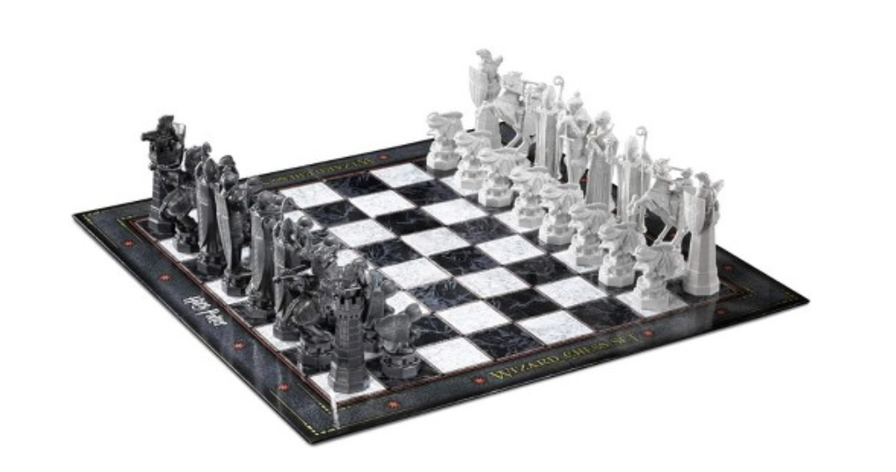
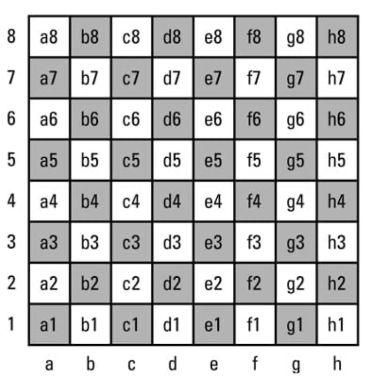

# Game Assignment Set: Chess




---

## Rules

* Normal chess rules

### Exception

Instead of the official three board state repetition draw rule:

```

For the last 8 moves:
    If (no capture OR no promotions OR no pawn movement) AND (moves {0,1,2,3} == {4,5,6,7}):
        A draw occurs

# {0,1,2,3} == {4,5,6,7}    if the starting position (rank and file) and ending position (rank and file) of the moves are identical
```

---

## AI Framework

### `make_move()`

* Fill in the `make_move()` function of the AI class

### Each call to `make_move()`:

* AI player returns a legal move
* Use the search algorithm specified in the assignment to select which legal move

### Note

1. **NEVER** modify the member variables of the AI framework classes
2. **IMPLEMENT** the state of the board & all data-structures

---

## Input

### Initial States and FEN Notation

* Program must support board states in [FEN notation](https://en.wikipedia.org/wiki/Forsyth–Edwards_Notation)

1. FEN starting position

> `rnbqkbnr/pppppppp/8/8/8/8/PPPPPPPP/RNBQKBNR w KQkq - 0 1`

2. And after the move 1.e4:

> `rnbqkbnr/pppppppp/8/8/4P3/8/PPPP1PPP/RNBQKBNR b KQkq e3 0 1`

3. And then after 1...c5:

> `rnbqkbnr/pp1ppppp/8/2p5/4P3/8/PPPP1PPP/RNBQKBNR w KQkq c6 0 2`

4. And then after 2.Nf3:

> `rnbqkbnr/pp1ppppp/8/2p5/4P3/5N2/PPPP1PPP/RNBQKB1R b KQkq - 1 2`

A FEN record contains six fields, each separated by a space. The fields are as follows:

1. Piece placement data: 

* Each rank is described, starting with rank 8 and ending with rank 1, with a "/" between each one; within each rank, the contents of the squares are described in order from the a-file to the h-file. 

* Each piece is identified by a single letter taken from the standard English names in algebraic notation (pawn = "P", knight = "N", bishop = "B", rook = "R", queen = "Q" and king = "K").

*  White pieces are designated using uppercase letters ("PNBRQK"), while black pieces use lowercase letters ("pnbrqk"). 
  
*  A set of one or more consecutive empty squares within a rank is denoted by a digit from "1" to "8", corresponding to the number of squares.

2. Active color: "w" means that White is to move; "b" means that Black is to move.

3. Castling availability: 

* If neither side has the ability to castle, this field uses the character "-". 

* Otherwise, this field contains one or more letters: "K" if White can castle kingside, "Q" if White can castle queenside, "k" if Black can castle kingside, and "q" if Black can castle queenside. 

* A situation that temporarily prevents castling does not prevent the use of this notation.

4. En passant target square: 

* This is a square over which a pawn has just passed while moving two squares.

*  It is given in algebraic notation. 

*  If there is no en passant target square, this field uses the character "-". 

* This is recorded regardless of whether there is a pawn in position to capture en passant. 

* An updated version of the spec has since made it so the target square is recorded only if a legal en passant capture is possible, but the old version of the standard is the one most commonly used.

5. Halfmove clock:

* The number of halfmoves since the last capture or pawn advance, used for the fifty-move rule.

6. Fullmove number: 

* The number of the full moves. It starts at 1 and is incremented after Black's move.



---

## Output

* Returns a move chosen by our algorithm

### Universal Chess Interface Notation

Examples: 

> e2e4
> 
> e7e5
> 
> e1g1 (white short castling)
> 
> e7e8q (for promotion)


* A "nullmove" from an engine to a GUI should be sent as 0000.