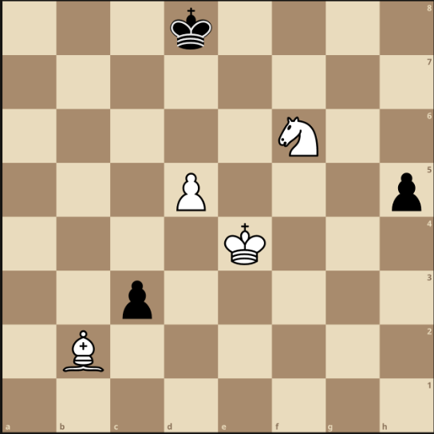

# Chess Program

---

## Scope

* Create a program that makes random **valid** chess moves
* Implement chess using the chess AI Framework

---

## Objectives

* Create a model of the game state and action generation

(to be used for future AI algorithms to solve)

### Overview

* Generate all pseudo-valid moves for all of your player's pieces in the current game state

* `Pseudo-valid == valid moves disregarding checks`

[Joueur](https://siggame.github.io/Joueur.py/)

[Joueur Class](https://siggame.github.io/Joueur.py/chess/index.html)

---

## Output

### On Each Turn

1. Print out in its own line: the number of moves available to your program
2. Print out in a single line: all moves available to your player program in alphabetical order
3. In the next line: print the randomly chosen move that the program returns to the chess server

* After, the program can print other stuff

### Moves Printed

* In universal chess notation

Examples: 

> e2e4
> 
> e7e5
> 
> e1g1 (white short castling)
> 
> e7e8q (for promotion)

### Sample Output

Input FEN string:

`3k4/8/5N2/3P3p/4K3/2p5/1B6/8 w - - 0 23`

(Corresponds to the following board...)



Output Format:

```
18 
b2a1 b2a3 b2c1 b2c3 d5d6 e4d3 e4d4 e4e3 e4e5 e4f3 e4f4 e4f5 
f6d7 f6e8 f6g4 f6g8 f6h5 f6h7 
My move = b2c1
```

**Note: Remember the special move rules for pawns and kings
**

---

## Implementation Requirements

* Only one language framework
* Delete the frameworks that aren't used
* Place code in `ai.py` file

If other files are used:
* Place them in the same folder as `ai.py` 
* Name the other files in the format `Game1*.py`
  
---

# Documentation


